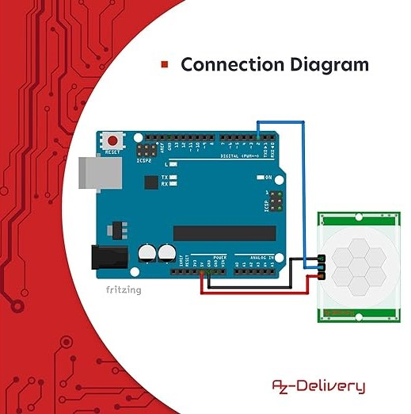
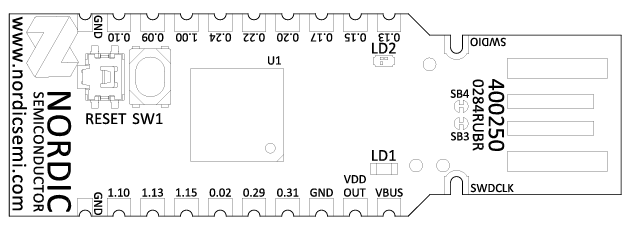

## Using GPIO Pins on the nRF52840 Dongle with a PIR Sensor for Motion Detection

### Overview
This brief guide will help you use the GPIO pins on the nRF52840 dongle to detect motion using a PIR (Passive Infrared) sensor. In this setup, the Arduino will power the PIR sensor, while the nRF52840 dongle will handle the sensor's output signal.

### Requirements
- nRF52840 Dongle
- Arduino board (e.g., Arduino Uno)
- PIR motion sensor (e.g., HC-SR501)
- Jumper wires
- Breadboard (optional)

### Wiring
1. **Arduino to PIR Sensor:** 
   - Connect the **VCC pin** of the PIR sensor to the **5V pin** on the Arduino.
   - Connect the **GND pin** of the PIR sensor to the **GND pin** on the Arduino.
   - Connect the **OUT pin** of the PIR sensor to the **digital pin 2** on the Arduino (used for power and testing).



2. **nRF52840 Dongle to PIR Sensor:**
   - Connect the **OUT pin** of the PIR sensor (shared connection) to the **P0.31 pin** on the nRF52840 dongle.
  


### Basic Arduino Example (for reference)
Here's a basic Arduino sketch to ensure the PIR sensor works correctly.

```cpp
const int pirPin = 2;
int pirState = LOW;
int val = 0;

void setup() {
  Serial.begin(9600);
  pinMode(pirPin, INPUT);
  Serial.println("Calibrating sensor...");
  delay(10000);
  Serial.println("Calibration done. Sensor is active.");
}

void loop() {
  val = digitalRead(pirPin);
  if (val == HIGH) {
    if (pirState == LOW) {
      Serial.println("Motion detected!");
      pirState = HIGH;
    }
  } else {
    if (pirState == HIGH) {
      Serial.println("Motion ended.");
      pirState = LOW;
    }
  }
}
```

### Using the nRF52840 Dongle with Contiki-NG

#### Example Code for Polling (Initial Working Code)
The following code sets up a process to read the PIR sensor state on the nRF52840 dongle using Contiki-NG.

```c
#include "contiki.h"
#include "dev/gpio-hal.h"
#include <stdio.h>

#define PIR_SENSOR_PIN 31 // Pin P0.31

PROCESS(pir_motion_process, "PIR Motion Sensor Process");
AUTOSTART_PROCESSES(&pir_motion_process);

PROCESS_THREAD(pir_motion_process, ev, data)
{
  static struct etimer et;

  PROCESS_BEGIN();

  gpio_hal_arch_init();

  // Initialize the GPIO pin as input with pull-up
  gpio_hal_arch_port_pin_cfg_set(0, PIR_SENSOR_PIN, NRF_GPIO_PIN_NOPULL);

  while(1) {
    int sensor_state = gpio_hal_arch_port_read_pin(0, PIR_SENSOR_PIN);

    printf("Sensor state: %d\n", sensor_state);
    if (sensor_state == 1) {
      // Motion detected
    }

    etimer_set(&et, CLOCK_SECOND);
    PROCESS_WAIT_EVENT_UNTIL(etimer_expired(&et));
  }

  PROCESS_END();
}
```

### Improved Code with Interrupts

To improve efficiency, use interrupts to handle PIR sensor events. This method eliminates active polling.

```c
#include "contiki.h"
#include <stdio.h>

#ifndef COOJA
#include "dev/gpio-hal.h"
#include "nrfx_gpiote.h"
#include "nrf_gpio.h"
#endif

#define PIR_SENSOR_PIN 31 // Pin P0.31

PROCESS(pir_motion_process, "PIR Motion Sensor Process");
AUTOSTART_PROCESSES(&pir_motion_process);

#ifndef COOJA
static void gpiote_event_handler(nrfx_gpiote_pin_t pin, nrf_gpiote_polarity_t action) {
  
  if (pin == NRF_GPIO_PIN_MAP(0, PIR_SENSOR_PIN)) {
    uint32_t pin_state = nrf_gpio_pin_read(NRF_GPIO_PIN_MAP(0, PIR_SENSOR_PIN));
    printf("Motion detected! PIR Sensor state: %ld\n", pin_state);
  }

}
#endif

PROCESS_THREAD(pir_motion_process, ev, data)
{
  PROCESS_BEGIN();

  gpio_hal_arch_init();

  #ifndef COOJA
  if (!nrfx_gpiote_is_init()) {
    if (nrfx_gpiote_init() != NRFX_SUCCESS) {
      printf("GPIOTE driver initialization failed!\n");
      PROCESS_EXIT();
    }
  }

  nrf_gpio_cfg_input(NRF_GPIO_PIN_MAP(0, PIR_SENSOR_PIN), NRF_GPIO_PIN_NOPULL);

  nrfx_gpiote_in_config_t in_config = NRFX_GPIOTE_CONFIG_IN_SENSE_TOGGLE(true);
  in_config.pull = NRF_GPIO_PIN_NOPULL;

  if (nrfx_gpiote_in_init(NRF_GPIO_PIN_MAP(0, PIR_SENSOR_PIN), &in_config, gpiote_event_handler) != NRFX_SUCCESS) {
    printf("GPIOTE input pin initialization failed!\n");
    PROCESS_EXIT();
  }

  nrfx_gpiote_in_event_enable(NRF_GPIO_PIN_MAP(0, PIR_SENSOR_PIN), true);
  #endif

  while(1) {
    PROCESS_YIELD();
  }

  PROCESS_END();
}
```

### Explanation
1. **Initialization of the GPIOTE Driver:**
   - Initializes the GPIOTE driver if it's not already initialized.

2. **GPIO Pin Configuration:**
   - Configures the PIR sensor pin as an input with no pull-up or pull-down resistors.

3. **GPIOTE Configuration:**
   - Sets up the GPIOTE to sense both rising and falling edges on the PIR sensor pin.

4. **GPIOTE Interrupt:**
   - Enables the GPIOTE interrupt for the configured pin and defines the `gpiote_event_handler` function to handle the interrupts.

### Additional Considerations
- **Debouncing:** Implement software debouncing to avoid false triggers due to noise. Debouncing is a technique used to ensure that only valid signals are recognized when a mechanical switch or sensor changes state. Mechanical contacts or sensors can generate multiple transient signals when they change state due to physical vibrations or other noise. Debouncing eliminates these false signals to ensure that only a single, clean signal is registered for each change of state.
- **Power Consumption:** Using interrupts helps reduce power consumption compared to active polling.
- **Error Handling:** Ensure robust error handling during initialization.

### Debouncing Example

In the following code debouncing is added to the interrupt handler.

```c
#include "contiki.h"
#include <stdio.h>

#ifndef COOJA
#include "dev/gpio-hal.h"
#include "nrfx_gpiote.h"
#include "nrf_gpio.h"
#endif

#define PIR_SENSOR_PIN 31 // Pin P0.31
#define DEBOUNCE_DELAY_MS 50 // 50 milliseconds debounce delay

PROCESS(pir_motion_process, "PIR Motion Sensor Process");
AUTOSTART_PROCESSES(&pir_motion_process);

#ifndef COOJA
static struct etimer debounce_timer;
static volatile bool motion_detected = false;

static void gpiote_event_handler(nrfx_gpiote_pin_t pin, nrf_gpiote_polarity_t action) {
  
  if (pin == NRF_GPIO_PIN_MAP(0, PIR_SENSOR_PIN)) {
    
    if (!etimer_expired(&debounce_timer)) {
      return; // Ignore if debounce timer is still running
    }

    etimer_set(&debounce_timer, DEBOUNCE_DELAY_MS * (CLOCK_SECOND / 1000));
    motion_detected = true;

  }

}
#endif

PROCESS_THREAD(pir_motion_process, ev, data)
{
  PROCESS_BEGIN();

  gpio_hal_arch_init();

  #ifndef COOJA
  if (!nrfx_gpiote_is_init()) {
    if (nrfx_gpiote_init() != NRFX_SUCCESS) {
      printf("GPIOTE driver initialization failed!\n");
      PROCESS_EXIT();
    }
  }

  nrf_gpio_cfg_input(NRF_GPIO_PIN_MAP(0, PIR_SENSOR_PIN), NRF_GPIO_PIN_NOPULL);

  nrfx_gpiote_in_config_t in_config = NRFX_GPIOTE_CONFIG_IN_SENSE_TOGGLE(true);
  in_config.pull = NRF_GPIO_PIN_NOPULL;

  if (nrfx_gpiote_in_init(NRF_GPIO_PIN_MAP(0, PIR_SENSOR_PIN), &in_config, gpiote_event_handler) != NRFX_SUCCESS) {
    printf("GPIOTE input pin initialization failed!\n");
    PROCESS_EXIT();
  }

  nrfx_gpiote_in_event_enable(NRF_GPIO_PIN_MAP(0, PIR_SENSOR_PIN), true);

  etimer_set(&debounce_timer, 0);

  while (1) {
    PROCESS_WAIT_EVENT();

    if (motion_detected && etimer_expired(&debounce_timer)) {
      uint32_t pin_state = nrf_gpio_pin_read(NRF_GPIO_PIN_MAP(0, PIR_SENSOR_PIN));
      printf("Motion detected! PIR Sensor state: %ld\n", pin_state);
      motion_detected = false;
    }

  }
  #endif

  PROCESS_END();
}
```

### Explanation
1. **Debounce Timer:**
   - A `struct etimer debounce_timer` is used to manage the debounce delay.

2. **Interrupt Handler with Debouncing:**
   - In the `gpiote_event_handler`, it checks if the debounce timer has expired. If not, it returns immediately.
   - If the timer has expired, it starts the debounce timer and sets the `motion_detected` flag.

3. **Process Loop:**
   - The loop waits for events and checks if the `motion_detected` flag is set and the debounce timer has expired. If so, it reads the pin state and processes the motion detection.

### Conclusion
By following this guide, you can successfully integrate a PIR sensor with the nRF52840 dongle while using the Arduino to power the sensor. This setup ensures reliable motion detection with efficient power consumption and proper handling of GPIO interrupts.
