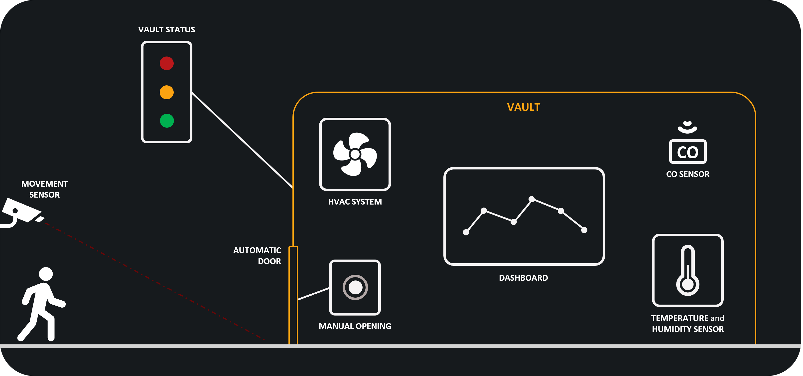

# IoT Project - VoltVault
This repository contains the source code, configuration files, and resources for the *VoltVault* IoT project. VoltVault is designed to ensure the safety and efficiency of an industrial battery room through careful monitoring and automated responses. This README will guide you through the structure of the repository and provide instructions on how to get started.



## Project Structure

The project is organized into the following directories:

- `Documentation/`: Contains project documentation and resources.
  - `Resources/`: Images and diagrams used in the documentation.
  - `Documentation.pdf`: Detailed documentation of the project.

- `Implementation/`: Contains the implementation of sensors, actuators, simulation scripts, and utility tools.
  
  - `Sensors/`: Source code and configuration files for various sensors.
    - `CO/`: Carbon Monoxide sensor.
      - `co.c`: Main source file for the CO sensor.
      - `resources/res-co.c`: Resource file for the CO sensor.
    - `Movement/`: Movement sensor.
      - `movement.c`: Main source file for the movement sensor.
      - `resources/res-movement.c`: Resource file for the movement sensor.
    - `TemperatureAndHumidity/`: Temperature and Humidity sensor.
      - `temperatureandhumidity.c`: Main source file for the temperature and humidity sensor.
      - `resources/res-temperatureandhumidity.c`: Resource file for the temperature and humidity sensor.
  
  - `Actuators/`: Source code for various actuators.
    - `VaultStatus/`: Status of the battery room and automatic door actuators.
      - `vaultstatus.c`: Main source file for the status of the battery room and automatic door actuators.
      - `resources/res-vaultstatus.c`: Resource file for the status of the battery room and automatic door actuators.
    - `HVAC/`: HVAC system.
      - `hvac.c`: Main source file for the HVAC actuator.
      - `resources/res-hvac.c`: Resource file for the HVAC actuator.
  
  - `Simulation/`: Simulation configuration and scripts.
    - `simulation.csc`: *Cooja* simulation script.
  
  - `Utility/`: Utility tools.

    - `JSON_SenML/`: JSON SenML library.
      - `json-senml.c`: Source file for JSON SenML functionality.
      - `json-senml.h`: Header file for JSON SenML functionality.

    - `RandomNumberGenerator/`: Random number generator utility.
      - `random-number-generator.c`: Source file for random number generator.
      - `random-number-generator.h`: Header file for random number generator.

  - `JavaApplication/`: Contains the Java code for the Cloud Application and the User Application.
    - `src/`: Source code.
    - `pom.xml`: Maven configuration file.

  - `BorderRouter/`: Configuration and scripts for the Border Router.
    - `border-router.c`: Source file for the border router (as available in Contiki-NG).

  - `Grafana/`: Configuration files for Grafana.
    - `VoltVault_Dashboard.json`: Grafana dashboard configuration file for VoltVault.
  
- `MachineLearning/`: Machine learning scripts and data.
  - `iot_telemetry_data.csv`: Dataset for IoT telemetry data.
  - `machine_learning.h`: Header file for machine learning functionality.
  - `training.ipynb`: Jupyter notebook for training the machine learning model.
  
## Installation

1. Clone the repository alongside Contiki-NG:
    ```bash
    git clone https://github.com/yourusername/IoT-Project.git
    git clone https://github.com/contiki-ng/contiki-ng.git
    cd IoT-Project
    ```

## Usage

The system can be both simulated on *Cooja* and deployed on *nRF52840 dongle* hardware.

### Simulation

To run the simulation, navigate to the `Simulation` directory and use Cooja:

1. Open Cooja from the Contiki-NG tools:
    ```bash
    cd contiki-ng/tools/cooja
    ./gradlew run
    ```
2. Load the simulation script.
    ```bash
    File -> Open simulation -> Select `simulation.csc`
    ```

### Flashing to nRF52840 dongle

To flash the project to the nRF52840 dongle use the `flash.sh` script:
  ```bash
  ./flash.sh
  ```   
For enabling the `distclean` option to clean the project before flashing, use:
  ```bash
  ./flash.sh distclean
  ```

### MySQL Database

The MySQL database is used to store the ip addresses of the sensors and actuators in the registration phase and to store the sensor or actuator data in the operation phase. If MySQL is not installed, you can install it using the following command:
  ```bash
  sudo apt-get install mysql-server
  ```

### Starting the System

1. Run the `start.sh` script in the root directory. This script ensures the correct setup of the MySQL database and starts the Border Router with the specified target (cooja or nrf52840). Ensure that the database credentials match your local configuration (predefined ones are `root` for username and `root` for password).
    ```bash
    ./start.sh cooja
    ```
    or
    ```bash
    ./start.sh nrf52840
    ```

2. Start the Java Application:
    ```bash
    cd Implementation/JavaApplication
    mvn clean package
    java -jar target/JavaApplication-1.0-SNAPSHOT.jar 
    ```

### Debug on nRF52840 dongle

For debugging purposes, it is possible to connect to the serial output of the nRF52840 dongles. To do so, use:
  ```bash
  ./login.sh
  ```

## Machine Learning

The `MachineLearning` directory contains scripts and data for training the Machine Learning model included in the HVAC system. To run the Jupyter notebook:

1. Install Jupyter Notebook if not already installed:
    ```bash
    pip install notebook
    ```
2. Navigate to the MachineLearning directory:
    ```bash
    cd MachineLearning
    ```
3. Start the Jupyter Notebook:
    ```bash
    jupyter notebook training.ipynb
    ```

## Grafana

The Grafana dashboard provides real-time data visualization and monitoring. It displays sensor readings and system status, allowing operators to remotely monitor the conditions within the battery room. To set up Grafana:

1. Install Grafana following the instructions on the [official website](https://grafana.com/get).
2. Configure Grafana to read data from the MySQL database used by this project.
3. Import the provided dashboard configuration (`Implementation/Grafana/VoltVault_Dashboard.json`) to visualize real-time data.

## License

This project is licensed under the MIT License. See the `LICENSE` file for details.
